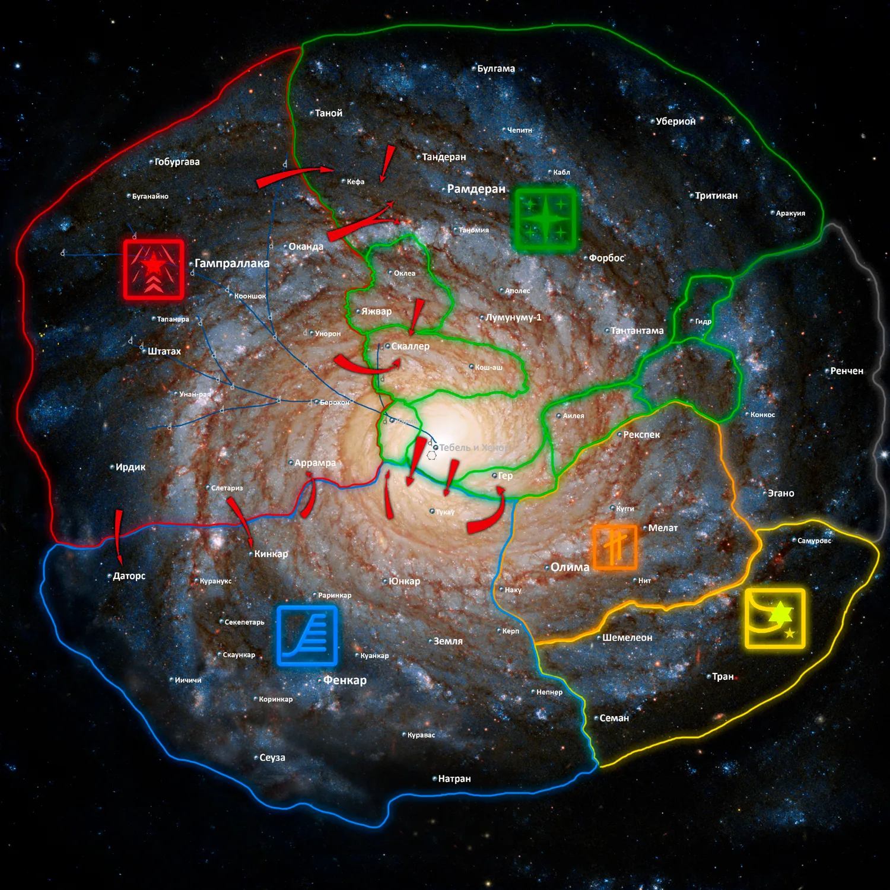

# Как добавлять статьи в вики

Статья — обычный Markdown-файл. Файлы лежат в `content/ru/` и `content/en/`, структура папок в обоих языках совпадает.

## Новая статья за три шага

1. Создайте файл на нужном языке, например `content/ru/guides/new-guide.md`, и такой же на втором языке — `content/en/guides/new-guide.md`.
2. Заполните шапку в начале файла:

   ```md
   ---
   title: Название статьи
   updated: 2026-09-15
   draft: true
   ---
   ```

3. Зарегистрируйте статью в `data/wiki-nav.json` в подходящей категории:

   ```json
   {
     "slug": "guides/new-guide",
     "title": { "ru": "Название статьи", "en": "Article title" },
     "desc": { "ru": "Краткое описание.", "en": "Short description." }
   }
   ```

   `slug` — путь к файлу без `content/<язык>/` и без `.md`. Порядок записей в массиве = порядок в меню и на главной вики.

## Шапка (front matter)

| Поле | Что делает |
| --- | --- |
| `title` | Заголовок статьи. В тексте `#` писать не нужно |
| `updated` | Дата в формате `ГГГГ-ММ-ДД`, выводится в подписи статьи |
| `draft: true` | Показывает бейдж «Черновик». Готово — поставьте `false` или удалите строку |

`title` в статье и в `wiki-nav.json` лучше держать одинаковыми.

## Текст и оглавление

- `##` и `###` автоматически попадают в оглавление (если заголовков меньше трёх, оглавление не выводится).
- Обычный Markdown: списки, **жирный**, таблицы — оформление подставляется сайтом.

## Ссылки

- На другую статью: `[текст](overview.md)` или из подпапки `[текст](../factions/fenearth.md)` — сайт сам превратит их в правильный адрес.
- На файлы: обычные относительные пути от статьи, например `../assets/img/lore/tc-ru.webp`.

## Картинки

Картинка отдельным абзацем превращается в фигуру с подписью из alt:

```md

```

Несколько картинок в одном абзаце собираются в галерею.

Картинки статей кладите в `assets/img/lore/` (не в `assets/img/gallery/` — там только галерея главной). Подробнее — `../assets/README.md`.

## Особые блоки

- Аудио (гимны, примеры речи):

  ```html
  <div class="audio-card"><span class="audio-card__label">Гимн</span><audio controls preload="metadata" src="../assets/audio/fenearth-anthem.mp3"></audio></div>
  ```

- Выноски: `<div class="callout">текст</div>` и `<div class="callout callout--warn">текст</div>`.

## Два языка

- Статья должна существовать в обеих папках с одинаковым slug.
- Если `ru` и `en` совпадают (например, имя собственное), `en` можно не писать — подставится русское значение (так же в файлах `data/`).
- **Русский текст — источник истины.** Если формулировки в языках расходятся, английский переводится с русского, а не наоборот.

## Терминология (RU → EN)

Единые варианты имён и терминов — используйте их во всех статьях и файлах `data/`:

| Русский | English |
| --- | --- |
| Фенземская Республика (ФЗР/Фензем) | Fenearth Republic (FR/Fenearth) |
| Движение Протон | Proton Movement |
| Единая Протонская Освободительная Армия | United Proton Liberation Army |
| Вастт, протонцы | Vasst, Protonians |
| Дегеры | Deguers |
| Всегалактическая Федерация (ВГФ) | Galactic Federation (GF) |
| Территория Отен | Oten Territory |
| Капо-Нантская / Капо-Бульская часть галактики | Capo-Nant / Capo-Bul sector of the galaxy |
| Минэль, минельцы | Minel, Minelians |
| Зиёнгоны | Ziyongons |
| Странники / Хранители | Wanderers / Keepers |
| Тройственный Конфликт | Triple Conflict |
| Война Очищения | War of Purification |
| Галактическая Смута | Galactic Turmoil |
| Период Затишья | Period of Calm |
| Период Гийи | Period of Gii |
| Далекое Прошлое | Distant Past |
| Территория Черного Рынка | Black Market Territory |
| Инкорпорация Независимых Регионов | Incorporation of Independent Regions |

Аббревиатуры без расшифровки пишутся в EN так же, как в игре: СИП → TIC, КЗС → DSC, МПВО → MAD, Дальнострел → Eye of Reach, СЛУК → SLSS.

## Как посмотреть локально

Сайт использует ES-модули и `fetch()`, поэтому открывать его нужно через локальный сервер:

```bash
python3 -m http.server 8000
```

и зайти на <http://localhost:8000>.
